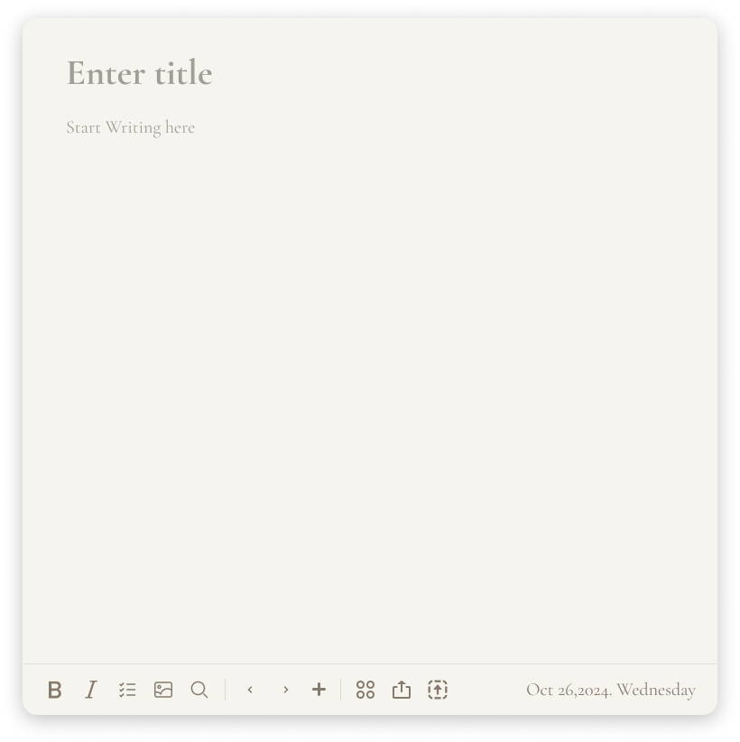

## 简介
这是一个以 .md 为核心的笔记应用，所有的笔记会使用 .md 格式存储在用户的 home/.draftx/notes/ 目录下（开发环境为 home/.draftx-test/notes/）。图片文件储存在 notes/.asset 文件夹中。

## 核心存储原则（重要）
1. **.md 文件是事实来源（source of truth）**：笔记的正文只存在于 .md 文件中，任何读取正文的需求都必须读文件，不允许把正文存入数据库
2. SQLite（~/.draftx/data/metaData.db）**仅存储元数据**：
   - `notes` 表：`path`（相对 notes 目录的文件路径）、`title`（笔记标题）、`mtime`（文件修改时间，毫秒时间戳）、`hash`（内容 sha1，用于检测外部修改）、`uuid`、`created_at`
   - `fts_index` 表：FTS5 全文索引虚表（`title` + `content` 两列，`tokenize='trigram'` 以支持中文检索；trigram 仅支持 ≥3 字符的查询，更短的查询回退到文件扫描），rowid 与 notes.id 对应，由 repositories 在写入时手动同步
3. 启动时通过 `syncNotesWithFiles()` 对账：磁盘新增文件入库、hash 变化重建索引、文件消失删除元数据
4. 空内容的笔记会被自动删除（md 文件 + 元数据 + 索引一起删）
5. 渲染进程通过自定义协议 `draftx-asset://notes/<相对路径>` 访问 notes 目录内的图片等资源（dev 的 http 环境与生产的 file:// 环境均可用）

## 技术栈
1. 前端：React + TypeScript
2. 后端：Node.js 
3. 数据储存： sqlite（仅元数据 + FTS 索引） + 文件系统（.md 文件为事实来源）
4. 组件：使用 shadcn-ui 组件库 去自定义自己的组件
5. md 核心编辑器：使用 [Vditor](https://github.com/vanessa219/vditor)（IR 即时渲染模式；数学公式/Mermaid 等离线资源在 frontend/public/vditor/）

## 设计范式
按照首页进行UI规范

### 颜色规范
- 文字颜色使用 ： #3A332C ，占位符使用该颜色的 45%透明度
- 主要颜色使用 ： #867A6C ，包括按钮、icon、卡片的底色
- 背景颜色使用 ： #F5F4EF ，整体的背景颜色
- 边框颜色使用 ： #E1E0DA 

### 字体
- 拉丁文文字 （比如英文），使用 Cormorant Garamond 字体， 如果没有需要帮我下载
- 中文字体，使用 LXGW WenKai Mono TC 字体， 如果没有需要帮我下载

### 圆角
- 圆角只能使用 8px、16px 、24px

注意：所有样式使用tailwindcss 实现

## 页面结构
先实现组件，再实现页面，按照React的哲学与原则实现页面与组件的组织

## 文件结构
- frontend：前端文件
- src ： 后端文件
  - src/core/noteFileService.ts：md 文件读写、哈希、图片落盘等文件操作
  - src/database/：notes 元数据表 + fts_index 索引，repository 层同步两者
- src/workers ： 线程
- scripts ： 打包的脚本文件

## 修改注意事项
1. 修改时不需要兼容旧数据，可以将旧表删除。不需要旧数据迁移
2. 不要把笔记正文写进 SQLite；新增笔记相关功能时，正文读写一律走 .md 文件
