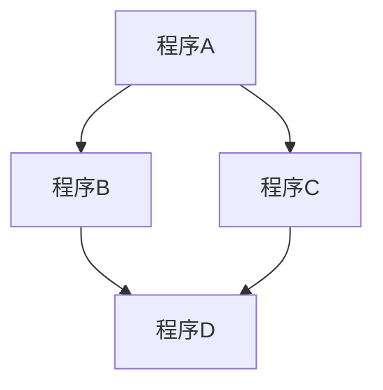
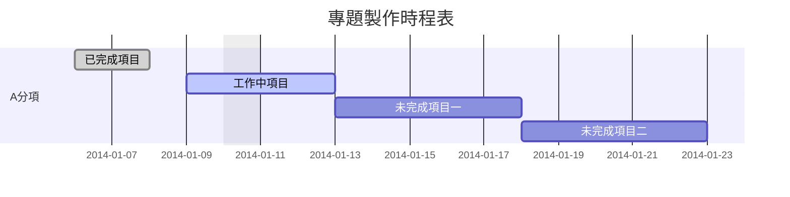
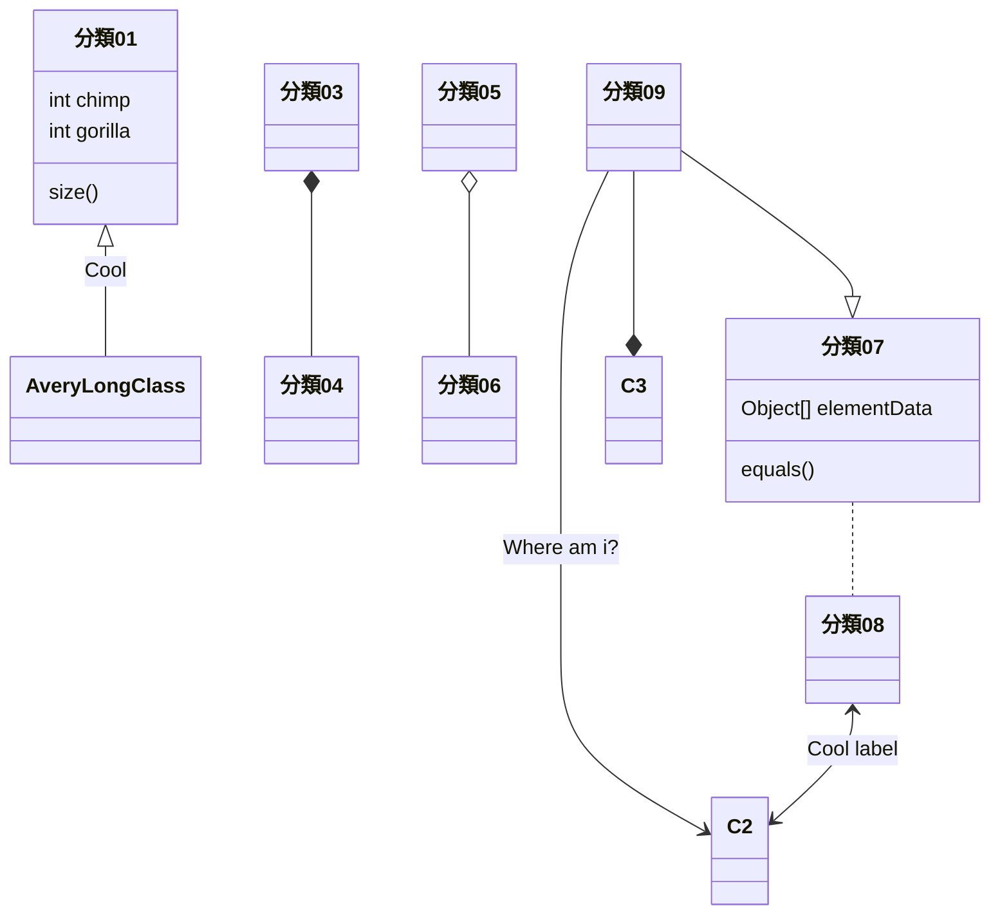
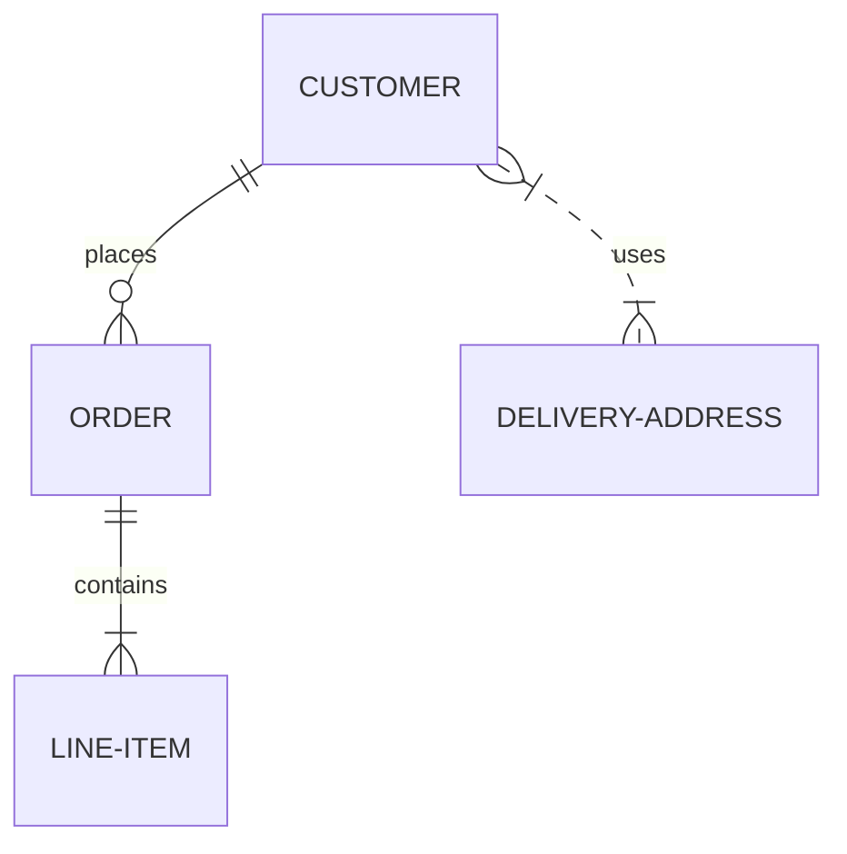
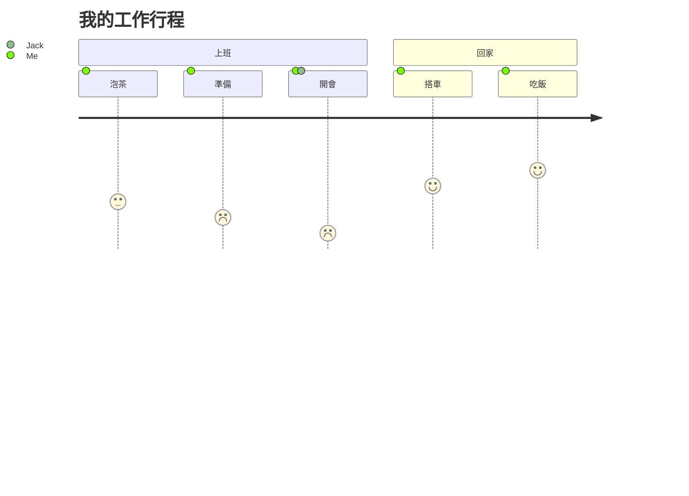

# Markdown 語法完全指南

這份文件展示了 Markdown 的各種語法與顯示效果。

## 1. 標題 (Headers)

使用 `#` 符號來表示標題層級，最多支援到六級。

# H1 標題 (最大的標題)

## H2 標題

### H3 標題

#### H4 標題

##### H5 標題

###### H6 標題

## 2. 文字樣式 (Text Styling)

| 樣式 | 語法 | 顯示效果 |
| ----- | ----- | ----- |
| 粗體 | **粗體** 或 __粗體__ | 粗體 |
| 斜體 | *斜體* 或 _斜體_ | 斜體 |
| 粗斜體 | ***粗斜體*** | 粗斜體 |
| ~~刪除線~~ | ~~刪除線~~ | ~~刪除線~~ |
| 行內程式碼 | `行內程式碼` | 行內程式碼 |

## 3. 列表 (Lists)

### 無序列表 (Unordered List)

使用 `-`、`*` 或 `+` 皆可。

- 項目 A
- 項目 B
  - 子項目 B-1
  - 子項目 B-2
- 項目 C

### 有序列表 (Ordered List)

使用數字加點 `1.`。

1. 第一點
2. 第二點
3. 第三點
   1. 子項目 3-1
   2. 子項目 3-2

### 任務列表 (Task List)

用來製作待辦清單。

- [x] 已完成的項目
- [ ] 未完成的項目

## 4. 引用 (Blockquotes)

使用 `>` 符號。

> 這是一段引用文字。
>
> > 這是巢狀引用 (引用中的引用)。
>
> 回到第一層引用。

## 5. 程式碼區塊 (Code Blocks)

使用三個反引號 ``` 包裹程式碼，並指定語言可啟用語法高亮。

**Python 範例：**

```Python
def hello_world():
    print("Hello, Markdown!")

hello_world()
```

**JavaScript** 範例：

```JavaScript
const message = "Markdown is awesome";
console.log(message);
```

## 6. 連結與圖片 (Links & Images)

### 連結

[Google 首頁](https://www.google.com/) 語法：`[顯示文字](網址)`

### 圖片

語法：``

## 7. 表格 (Tables)

使用 `|` 分隔欄位，使用 `-` 分隔標題列。 冒號 `:` 可用來控制對齊方向。

| 左對齊 | 置中對齊 | 右對齊 |
| :----- | :-----:| -----: |
| 內容 A | 內容 B | 內容 C |
| 靠左 | 居中 | 靠右 |

語法範例：

```
| 左對齊 | 置中對齊 | 右對齊 |
| :----- | :----: | -----: |
| 內容 A | 內容 B | 內容 C |
```

## 8. 分隔線 (Horizontal Rules)

使用三個以上的 `-`、`*` 或 `_`。

## 9. 數學公式 (Math / LaTeX)

使用 `$` 包裹行內公式，使用 `$$` 包裹區塊公式。

行內公式：

質能守恆公式為 $E = mc^2$。

**區塊公式：**

$$
\sum_{i=1}^{n} i = \frac{n(n+1)}{2}
$$

## 10. 流程圖與圖表 (Mermaid)

Markdown 支援使用 Mermaid 語法來繪製各種圖表。請使用程式碼區塊並指定語言為 `mermaid`。

### 流程圖 (Flowchat)  
```
graph TD;
    程序A-->程序B;
    程序A-->程序C;
    程序B-->程序D;
    程序C-->程序D;
```



### 時序圖 (Sequence Diagram)
```
sequenceDiagram
    participant 小美
    participant 小明    
    小美->>小華: Hi, 小華早呀！
    loop 腦中不斷思考
        小華->>小華: 輕聲唸到「怎麼辦」
    end
    Note right of 小華: 下定決心 <br/>就這麼回吧!
    小華-->>小美: 早呀！你今天看起來心情不錯噢！
    小華->>小明: 小明，今天怎麼這麼早？
    小明-->>小華: 你猜？
```



```mermaid
sequenceDiagram
    participant 小美
    participant 小明    
    小美->>小華: Hi, 小華早呀！
    loop 腦中不斷思考
        小華->>小華: 輕聲唸到「怎麼辦」
    end
    Note right of 小華: 下定決心 <br/>就這麼回吧!
    小華-->>小美: 早呀！你今天看起來心情不錯噢！
    小華->>小明: 小明，今天怎麼這麼早？
    小明-->>小華: 你猜？
```

### 甘特圖 (Gantt Diagram)
```
gantt
dateFormat  YYYY-MM-DD
title 專題製作時程表
excludes weekdays 2014-01-10

section A分項
已完成項目   :done,    des1, 2014-01-06,2014-01-08
工作中項目   :active,  des2, 2014-01-09, 3d
未完成項目一 :         des3, after des2, 5d
未完成項目二 :         des4, after des3, 5d
```



### 程式類別圖 (Class Diagram)
```
classDiagram
分類01 <|-- AveryLongClass : Cool
分類03 *-- 分類04
分類05 o-- 分類06
分類07 .. 分類08
分類09 --> C2 : Where am i?
分類09 --* C3
分類09 --|> 分類07
分類07 : equals()
分類07 : Object[] elementData
分類01 : size()
分類01 : int chimp
分類01 : int gorilla
分類08 <--> C2: Cool label
```



### Git分支圖 （Mermaid實驗中）
```
gitGraph:
options
{
    "nodeSpacing": 150,
    "nodeRadius": 10
}
end
commit
branch newbranch
checkout newbranch
commit
commit
checkout master
commit
commit
merge newbranch
```


### 實體關係圖 (Entity Relationship Diagram)  （Mermaid實驗中）
```
erDiagram
    CUSTOMER ||--o{ ORDER : places
    ORDER ||--|{ LINE-ITEM : contains
    CUSTOMER }|..|{ DELIVERY-ADDRESS : uses
```



### 使用者旅程圖 (User Journey Diagram)
**使用者名稱只能用英文**
```
journey
    title 我的工作行程
    section 上班
      泡茶: 3: Me
      準備: 2: Me
      開會: 1: Me, Jack
    section 回家
      搭車: 4: Me
      吃飯: 5: Me
```




## 11. 其他 (Others)

### 跳脫字元 (Escaping)

如果你想顯示特殊符號而不是使用它的語法功能，請在前面加反斜線 `\`。

\*這不是斜體\*

\# 這不是標題

\$$這不是連結\$$

### 註腳 (Footnotes)

這是一個註腳的例子[^1](https://gemini.google.com/app/這裡是註腳的內容說明，會顯示在文章底部。)。